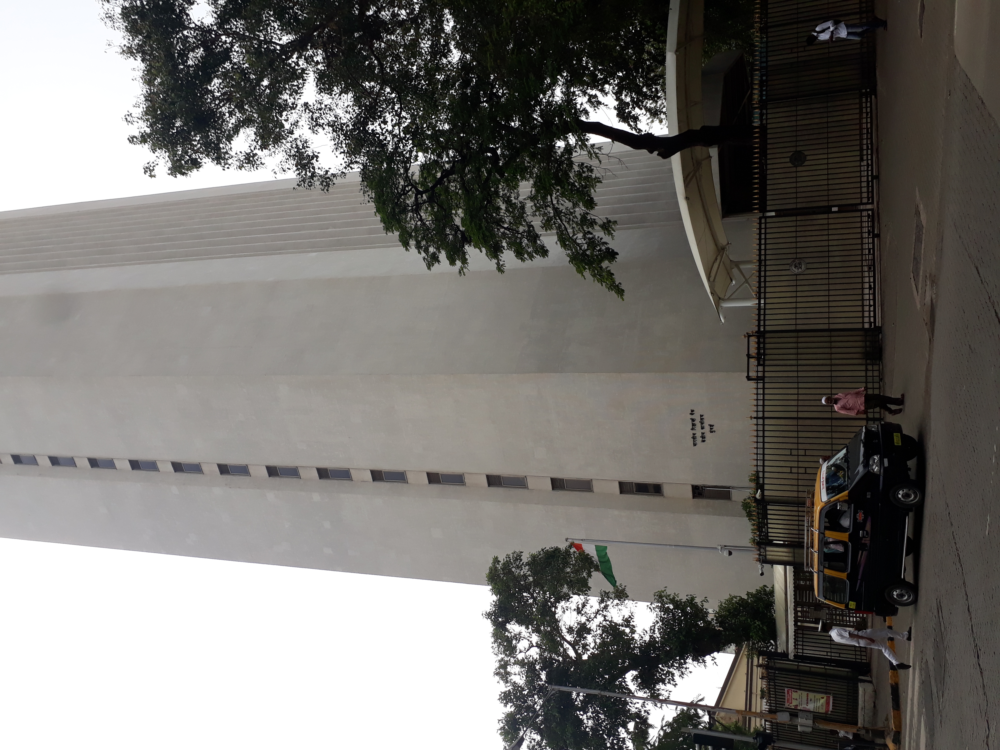
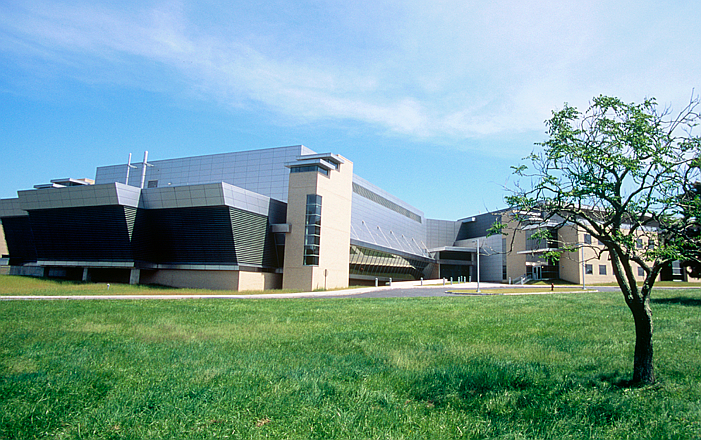
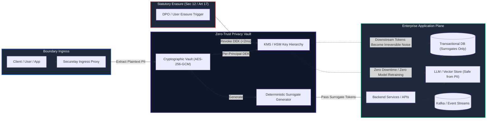

# Cross-Framework Compliance & Architecture Matrix
### Mapping ISO/IEC 27001:2022, SOC 2 Type II, and NIST CSF to India's DPDP Act 2023, ISO/IEC 42001 (AI Management), and NIST AI RMF 1.0

---

## 1. The CISO Dilemma: The "Load-Bearing but Thin" Mapping Fallacy

*Figure 1: The Parliament of India, New Delhi — Legislative origin of the Digital Personal Data Protection Act (DPDP Act 2023).*

For enterprise security leadership—Chief Information Security Officers (CISOs), Data Protection Officers (DPOs), and Head of Architecture—cross-framework compliance across ISO 27001, SOC 2, and NIST CSF was historically treated as an exercise in crosswalk spreadsheets and evidence collection automation.

However, when an organization layers **India's DPDP Act 2023**, **ISO/IEC 42001 (Artificial Intelligence Management System)**, and **NIST AI RMF 1.0** over an existing ISO 27001/SOC 2 estate, traditional GRC crosswalks break down catastrophically. 

> [!WARNING]
> **The Thin Mapping Trap**: GRC tools and spreadsheets cheerfully report that a control like *ISO 27001 A.9 (Access Control)* or *SOC 2 CC6.1* "maps" to *ISO 42001 A.8 (AI Data Management)* and *DPDP Section 8 (Reasonable Security Safeguards)*. On paper, coverage is 100%. In production runtime reality, coverage is 0%: IAM controls verify *who* can access a database, but they cannot prevent an LLM prompt from leaking raw Aadhaar numbers to a third-party model provider, nor can they execute a statutory erasure command across vector embeddings and immutable backup snapshots.

Securelay solves this architectural divide by providing a **zero-trust runtime security boundary and privacy vault** that transforms paper-thin policy mappings into mathematically enforceable cryptographic invariants.

---

## 2. Six-Framework Unified Control Matrix

The table below maps the statutory mandates of the **DPDP Act 2023** and **EU GDPR** alongside enterprise security standards (**ISO 27001**, **SOC 2 Type II**) and frontier AI governance frameworks (**ISO/IEC 42001**, **NIST AI RMF 1.0**), contrasting legacy GRC assumptions with Securelay’s runtime cryptographic guarantees.

| Security & Privacy Domain | ISO/IEC 27001:2022 | SOC 2 Type II (TSC) | India DPDP Act 2023 | EU GDPR | ISO/IEC 42001:2023 (AI) | NIST AI RMF 1.0 | Securelay Runtime Invariant |
| :--- | :--- | :--- | :--- | :--- | :--- | :--- | :--- |
| **API Ingestion & Data Minimization** | A.8.11 (Data Masking) A.8.12 (Data Leakage Prevention) | CC6.1 (Logical Access) CC6.6 (Boundary Protection) | **Section 6(1)** (Notice & Consent) **Section 8(5)** (Data Minimization) | Article 5(1)(c) (Data Minimisation) Article 25 (Privacy by Design) | A.8.2 (Data for AI) A.8.4 (Data Acquisition) | **MAP 1.5** (Data & Model Lineage) **MEASURE 2.6** (Data Quality & Integrity) | **Ingress Proxy Tokenization**: All sensitive personal entities (Aadhaar, PAN, email, phone) are intercepted at API gateway ingress and replaced with deterministic high-entropy surrogate tokens before reaching application code, logs, or databases. |
| **AI Prompt Sanitization & Subprocessing** | A.5.23 (Information Security in Cloud Services) A.8.24 (Cryptography) | CC6.6 (Perimeter Controls) PI1.4 (Data Protection) | **Section 8(5)** (Protect Personal Data in Custody/Control) **Section 16** (Cross-Border Transfer) | Article 28 (Processor Contracts) Article 44 (General Principle for Transfers) | **A.6.2.2** (AI System Requirements) **A.9.3** (Monitoring AI Systems) | **GOVERN 1.2** (Risk Management Integration) **MANAGE 2.4** (Third-Party Risk Management) | **In-Flight Surrogate Swapping**: LLMs (OpenAI, Anthropic, Bedrock, Azure) receive purely de-identified surrogate tokens (`[TOKEN_USR_9482]`). Real citizen PII never crosses external network perimeters or enters external model weights. |
| **Statutory Erasure vs Financial Ledgers** | A.8.10 (Information Deletion) A.8.14 (Redundancy of Processing Facilities) | CC6.7 (Data Transmission) CC7.2 (Security Events) | **Section 12(3)** (Mandatory Erasure upon Consent Withdrawal) **Section 33** (Up to ₹250 Cr Penalty) | Article 17 (Right to Erasure / "To Be Forgotten") | **A.8.3** (Data Quality for AI) **A.10.3** (Continuous Learning Governance) | **MEASURE 2.6** (Residual Risk Assessment) **MANAGE 2.2** (Mechanisms to Address Unintended Bias/Outputs) | **NIST SP 800-88 Cryptographic Shredding**: Per-subject individual Data Encryption Keys (DEKs) in KMS/HSM are destroyed in <2ms. Downstream read-replicas, vector embeddings, Kafka streams, and cold backups become mathematically unrecoverable noise, while financial ledger rows retain surrogate tokens to satisfy PMLA & Companies Act audit rules. |
| **Tamper-Evident Audit Logging** | A.8.15 (Logging) A.8.16 (Monitoring Activities) | CC7.2 (Incident Monitoring) CC7.3 (Audit Evaluation) | **Section 8(6)** (Mandatory CERT-In Breach Notification in 6 Hours) | Article 33 (Notification of Personal Data Breach) | **A.9.2** (AI System Logging & Auditing) **A.6.2.8** (Traceability) | **MEASURE 2.7** (Effectiveness of Measurement Systems) **MANAGE 1.3** (Audit Logging) | **HMAC-SHA256 Cryptographic Receipts**: Every tokenization, de-tokenization, and key-shredding event generates a zero-knowledge immutable receipt signed with ed25519/HMAC, verifiable by forensic auditors without exposing plaintext personal data. |
| **Data Lineage & Training Provenance** | A.5.12 (Classification of Information) A.8.1 (User Endpoint Devices) | CC6.2 (User Registration) PI1.1 (Privacy Notice) | **Section 9** (Processing of Children's Personal Data) **Section 4** (Lawful Processing) | Article 6 (Lawfulness of Processing) Article 9 (Special Categories) | **A.8.2** (AI Training Data Lineage) **A.8.4** (Data Preparation) | **MAP 1.5** (Data Lineage & Model Card Provenance) **GOVERN 3.2** (Accountability Structures) | **Deterministic Lineage Verification**: Cryptographic tags link every surrogate token directly to its explicit Data Principal consent grant and purpose specification, preventing untagged data from contaminating training pipelines or vector indexes. |

---

## 3. The Four Critical "Orphan" Gaps Exposed

*Figure 2: Reserve Bank of India (RBI) Headquarters, Mumbai — Authority mandating real-time model risk governance and cyber resilience.*

### Gap 1: Model Provenance vs Database Access Control
- **The Paper Assumption**: "Our ISO 27001 Annex A.9 (Access Control) and SOC 2 CC6.1 policies ensure that only authorized data scientists can read the training S3 bucket."
- **The Runtime Reality**: Access control verifies authorization to the bucket; it provides zero evidence regarding whether the records inside that bucket contain unconsented personal data, children's data (DPDP Section 9), or biometric identifiers. Once personal data is ingested into an LLM fine-tuning corpus or RAG vector index, it is irrevocably baked into high-dimensional matrix weights.
- **Securelay Solution**: Ingestion-time tokenization isolates plaintext before raw data lands on disk. Training pipelines ingest high-entropy surrogate tokens, ensuring raw PII never enters model checkpoints.

### Gap 2: Prompt Leakage vs Transport Layer Security (TLS)
- **The Paper Assumption**: "All external API traffic uses TLS 1.3 encryption (ISO 27001 A.8.24 / SOC 2 CC6.7), so data in transit is secure."
- **The Runtime Reality**: TLS terminates at the third-party endpoint. Once decrypted by OpenAI, Anthropic, or an external cloud vendor, customer PAN, Aadhaar, and health queries reside in third-party memory and log infrastructure—constituting an unauthorized cross-border subprocessor data transfer under DPDP Section 16 and GDPR Article 44.
- **Securelay Solution**: Securelay acts as an in-line reverse proxy between enterprise code and model APIs. Prompts are dynamically de-identified into format-preserving tokens; responses are re-identified via role-based access control (RBAC) only within the enterprise perimeter.

### Gap 3: Neural Network Unlearning vs Statutory Right to Erasure
- **The Paper Assumption**: "Our application supports user deletion via a background worker executing `DELETE FROM users WHERE id = ?`."
- **The Runtime Reality**: A database DELETE leaves personal data in database WAL logs, read replicas, Kafka topic streams, Snowflake data warehouses, and vector database embeddings. You cannot execute a SQL DELETE on a vector embedding or an LLM weight without complete vector re-indexing or model re-training.
- **Securelay Solution**: NIST SP 800-88 Cryptographic Shredding. By assigning each Data Principal an individual per-subject Data Encryption Key (DEK), wiping the key from the vault instantly invalidates every downstream reference across all analytical databases, vector stores, and backup archives in milliseconds.

*Figure 3: NIST Advanced Measurement Laboratory Campus, Gaithersburg, MD — Home of NIST SP 800-88 Media Sanitization Standards.*

### Gap 4: Forensic Auditability vs Self-Reported Spreadsheets
- **The Paper Assumption**: "Our annual SOC 2 Type II auditor reviews sample tickets and vendor questionnaires to certify privacy compliance."
- **The Runtime Reality**: In the event of a regulatory inquiry by the Data Protection Board of India or CERT-In following a reported incident, self-reported questionnaires and static policies carry zero evidentiary weight against forensic log inspection.
- **Securelay Solution**: Cryptographic Proof of Shredding. Securelay issues an ed25519-signed cryptographic certificate containing timestamp, KMS key deletion digest, and token lineage hashes, providing indisputable mathematical evidence of compliance for regulatory authorities.

---

## 4. How CISOs & DPOs Implement Securelay in 3 Days

1. **Day 1: Zero-Code Ingress Gating**: Deploy the lightweight Securelay proxy or in-process SDK to intercept and tokenize high-risk statutory identifiers (Aadhaar, PAN, phone, email, health records).
2. **Day 2: AI Pipeline & Database Descoping**: Configure existing database schemas, Kafka producers, and LLM prompt templates to consume surrogate tokens, instantly removing customer databases and vector stores from statutory breach blast radius.
3. **Day 3: Cryptographic Shredding & CISO Audit Verification**: Execute simulated DPDP Section 12 consent revocations; verify automated KMS key shredding and inspect verifiable cryptographic receipts in CI/CD.

---

## 5. Executive Verification & Architecture Consultation

Securelay provides hands-on technical architecture reviews and pilot licenses for enterprise engineering teams, CISOs, and Data Protection Officers navigating DPDP Act 2023, ISO/IEC 42001, and cross-border compliance.

  
  
<em>Statutory enforcement under the DPDP Act 2023 establishes direct executive accountability for enterprise data fiduciaries.</em>

* **Architecture Reference Blueprint**: [https://github.com/professor2004h/securelay-dpdp-architecture](https://github.com/professor2004h/securelay-dpdp-architecture)
* **Lead Architect & Founder**: [Shanmukh Chitturi on LinkedIn](https://www.linkedin.com/in/shanmukh-chitturi/)
* **Direct Engineering & Pilot Desk**: `securelay.com@gmail.com`
* **Official Website**: [https://securelay.com](https://securelay.com)
