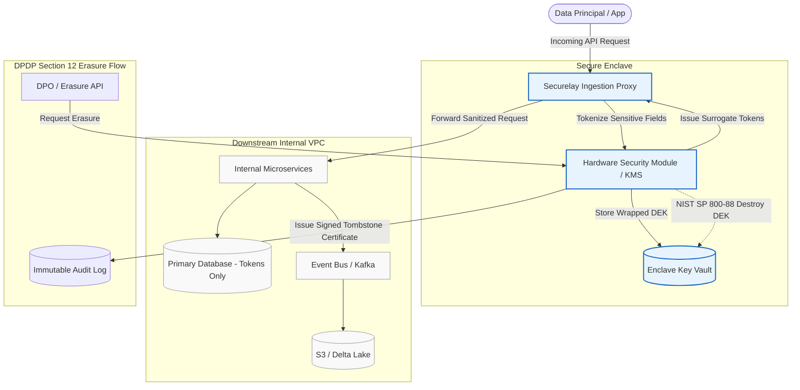

# The CISO & DPO Technical Audit Playbook
### Verifiable Architecture Compliance for India's DPDP Act 2023 & Cross-Border Data Privacy

---

## 1. Executive Summary for Data Protection Officers & CISOs

Under India’s **Digital Personal Data Protection Act (DPDP Act 2023)**, Data Fiduciaries and Significant Data Fiduciaries (SDFs) face unprecedented statutory liabilities:
* **Section 33 & Schedule 1**: Fines reaching up to **₹250 Crore (~$30M USD)** per violation for failure to observe reasonable security safeguards to prevent personal data breaches.
* **Section 12(3)**: An unambiguous mandate to irrevocably erase personal data upon withdrawal of consent or once the specified business purpose has been fulfilled.
* **CERT-In Cyber Security Directions**: Mandatory 6-hour cybersecurity breach reporting window, creating extreme operational risk if plaintext personal data is compromised.

For Chief Information Security Officers (CISOs), Data Protection Officers (DPOs), and IT Directors, compliance cannot rely on paper policies or developer-level conventions. It requires **cryptographically verifiable technical boundaries**.

---

## 2. The Four Critical Audit Gaps in Traditional Architectures

When Cert-In empaneled auditors or internal compliance teams review enterprise software stacks, four structural vulnerabilities consistently surface:

| Vulnerability Area | Legacy Implementation | Audit Exposure | Securelay Cryptographic Remedy |
| :--- | :--- | :--- | :--- |
| **Data Ingestion** | Plaintext PII enters API Gateway and traverses internal VPC unencrypted | Logs, traces, microservices, and metrics tools capture PII (Shadow Data) | **Edge Ingestion Proxy**: Ingress fields tokenized at reverse proxy boundary into opaque UUIDv4 tokens |
| **Data Erasure** | `UPDATE users SET deleted_at = NOW()` (SQL Soft Deletes) | Forensic recovery possible; raw PII remains in WAL, replica disks, and analytical Parquet dumps | **NIST SP 800-88 Cryptographic Shredding**: Destruction of the principal's individual DEK renders all copies ciphertext noise |
| **Cross-Framework Conflict** | Financial regulations (RBI/SEBI) require 7-year retention; DPDP/GDPR requires prompt erasure | Database deletion breaks audit trail referential integrity | **Cryptographic Decoupling**: Audit ledger retains surrogate tokens for financial audit; PII payload is permanently unreadable |
| **Breach Blast Radius** | Plaintext database dumps leaked via compromised credentials | Immediate catastrophic notification obligation to CERT-In and Data Protection Board | **Zero Plaintext at Rest**: Attacker obtains only opaque surrogate tokens with zero cryptographic utility |

---

## 3. Statutory Compliance Checklist for DPOs & Security Auditors

### Phase A: Notice, Consent & Data Minimization (Sections 5 & 6)
- [x] Sensitive fields (PAN, Aadhaar, phone, email, biometric/health data) mapped and classified at the ingress boundary.
- [x] Ingestion Proxy strips or replaces raw PII before routing to internal microservices, caching layers (Redis), or message buses (Kafka).
- [x] Format-Preserving Encryption (FPE) or Surrogate Tokenization utilized so internal microservices function without handling plaintext.

### Phase B: Cryptographic Erasure Verification (Section 12)
- [x] Per-principal Data Encryption Key (DEK) architecture deployed, protected by HSM/KMS root Key Encryption Key (KEK).
- [x] Erasure requests trigger instant DEK zeroization in the key enclave.
- [x] Verified zeroization satisfies **NIST SP 800-88 Rev. 1** cryptographic sanitize requirements across all downstream backups and data lakes.
- [x] Cryptographically signed **Tombstone Certificate** (HMAC-SHA256) generated with timestamp and operator metadata for auditable compliance reporting.

### Phase C: Breach Containment & CERT-In Alignment
- [x] Plaintext personal data isolated strictly within a hardened Enclave / KMS environment.
- [x] In the event of a downstream database compromise, exfiltrated tables contain only surrogate tokens (`tok_...`), mitigating public breach severity and statutory liability.

---

## 4. Architecture Verification & Data Flow

---

## 5. Executive Consultation & Enterprise Pilot Program

Securelay is dedicated to partnering with Chief Information Security Officers (CISOs), Data Protection Officers (DPOs), and enterprise engineering leadership to achieve verifiable, stress-tested compliance.

### How We Engage with Enterprise Teams:
1. **Confidential DPDP Architecture Audit**: A structured review of your data ingestion pathways, database persistence models, and backup pipelines to identify Section 12 and Section 33 exposure points.
2. **Zero-Friction Pilot Deployment**: Deploy the Securelay Ingestion Proxy in your staging environment as a drop-in container or sidecar. Evaluate latency (< 1.2ms) and observe transparent tokenization without modifying existing business logic.
3. **Third-Party Auditor Dossier**: Comprehensive architectural documentation, formal key lifecycle proofs, and tombstone audit trails prepared specifically for Cert-In and external compliance evaluators.

---

## 6. Connect with Leadership

* **Shanmukh Chitturi**  
  *Principal Privacy Architect & Co-Founder*  
  LinkedIn: [https://www.linkedin.com/in/shanmukh-chitturi/](https://www.linkedin.com/in/shanmukh-chitturi/)  
  Email: [securelay.com@gmail.com](mailto:securelay.com@gmail.com)  

* **Company Website**: [https://securelay.com](https://securelay.com)  
* **Architecture Repository**: [https://github.com/professor2004h/securelay-dpdp-architecture](https://github.com/professor2004h/securelay-dpdp-architecture)

*To schedule an executive briefing or technical architecture evaluation, please connect on LinkedIn or reach out directly via email.*
