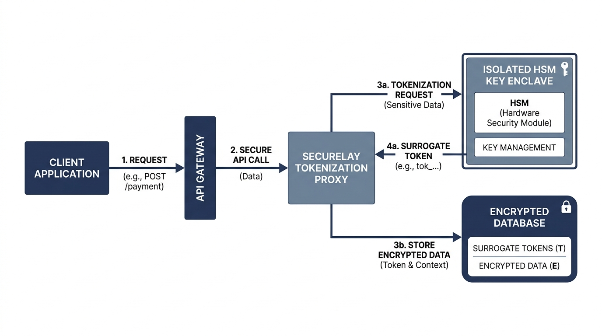
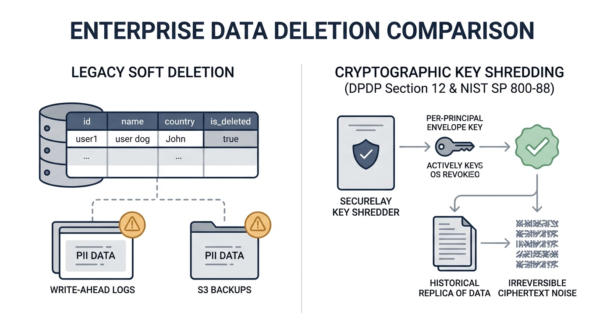
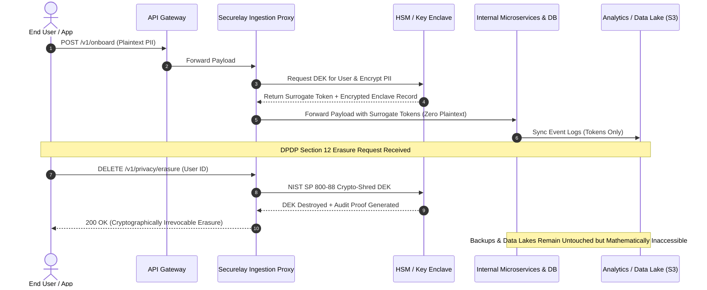

# Securelay DPDP Architecture Reference
### Enterprise Zero-Trust Ingestion Tokenization & NIST SP 800-88 Cryptographic Shredding for India's DPDP Act 2023

[](https://opensource.org/licenses/Apache-2.0)
[](https://www.python.org/)
[](https://csrc.nist.gov/publications/detail/sp/800-88/rev-1/final)
[](https://www.meity.gov.in/)
[](https://www.linkedin.com/in/shanmukh-chitturi/)

---

## 1. Executive Summary & The Enterprise Dilemma

Under Section 12 of India’s **Digital Personal Data Protection (DPDP) Act 2023** and **GDPR Article 17**, Data Fiduciaries must irrevocably erase personal data once the specified business purpose is completed or upon user consent withdrawal. Non-compliance carries statutory penalties reaching up to **₹250 Crore (~$30M USD)** per incident under the DPDP Act.

### The Engineering Reality
Modern high-throughput cloud architectures are inherently distributed and immutable:
* **Storage Immutability**: Write-Ahead Logs (WAL) in PostgreSQL/MySQL, append-only logs in Apache Kafka, partitioned Parquet files in Amazon S3 / Delta Lake, and Redis read replicas.
* **The "Soft Delete" Fallacy**: Executing `UPDATE users SET deleted_at = NOW()` leaves plaintext PII in database disk pages, CDC streams, snapshot backups, and data lakes indefinitely.
* **The "Physical Overwrite" Impossibility**: Physically locating and zeroing out individual records across terabytes of compressed, columnar parquet backups or distributed storage blocks destroys backup integrity and incurs catastrophic I/O costs.

---

## 2. The Securelay Two-Tier Architecture

Securelay solves this dilemma through a high-performance, two-tier privacy infrastructure:



### Tier 1: Zero-Trust Ingestion Proxy & Field-Level Tokenization
Before sensitive payload fields (Aadhaar, PAN, phone numbers, emails, health records) penetrate your internal VPC, the **Securelay Ingestion Proxy** intercepts incoming API traffic.
* **Hardware Security Module (HSM) / KMS Enclave**: Sensitive fields are tokenized into opaque UUIDv4 or format-preserving tokens backed by AES-256-GCM envelope encryption.
* **Per-Principal Data Encryption Keys (DEK)**: Every user/entity is assigned an isolated Data Encryption Key (DEK) wrapped by a root Key Encryption Key (KEK) inside the secure enclave.
* **Downstream Safety**: Internal microservices, message queues (Kafka), search clusters (Elasticsearch), and data warehouses receive and store **only surrogate tokens**. Raw PII never touches downstream disk.

### Tier 2: NIST SP 800-88 Cryptographic Shredding
When a data erasure request is received under DPDP Section 12:



Instead of running destructive disk rewrites across distributed clusters:
1. The user's individual **Data Encryption Key (DEK)** is purged from the Key Management Service and HSM enclave cache.
2. The key deletion is verified and an immutable, cryptographically signed **Tombstone Certificate** is logged for regulatory audit.
3. **Immediate Mathematical Infeasibility**: All historical backups, snapshots, Kafka logs, and data lake records referencing that token become instantly and permanently unreadable ciphertext (2^256 brute-force complexity). This satisfies **NIST SP 800-88 Rev. 1** cryptographic sanitize requirements.

---

## 3. Architecture Data Flow



---

## 4. Reference Implementation

This repository provides an enterprise reference implementation demonstrating:
1. **`securelay_dpdp/proxy`**: ASGI/FastAPI reverse proxy middleware performing zero-overhead payload inspection and field-level tokenization.
2. **`securelay_dpdp/shredder`**: Key lifecycle manager implementing envelope key separation (KEK/DEK) and NIST SP 800-88 cryptographic key shredding with auditable tombstone events.

### Installation & Quickstart

```bash
# Clone the repository
git clone https://github.com/professor2004h/securelay-dpdp-architecture.git
cd securelay-dpdp-architecture

# Install dependencies
pip install -r requirements.txt

# Run the test suite
pytest tests/ -v
```

### Running the Example Server

```bash
python examples/app.py
```

Send a sample customer onboarding request:
```bash
curl -X POST http://localhost:8000/api/customers \
  -H "Content-Type: application/json" \
  -d '{
    "user_id": "usr_94819",
    "name": "Arjun Sharma",
    "email": "arjun@example.com",
    "pan_card": "ABCDE1234F",
    "phone": "+919876543210"
  }'
```
Notice that downstream logs and database tables receive sanitized tokens (`tok_...`), while authorized read paths can be selectively detokenized with strict role-based policy enforcement.

---

## 5. Security & Compliance Verification

| Requirement | Traditional Storage | Securelay Zero-Trust Architecture |
| :--- | :--- | :--- |
| **DPDP Act Sec. 12 Erasure** | ❌ Manual scripts, soft-deletes fail audits | ✅ Instant cryptographic purge via DEK destruction |
| **Backup Integrity** | ❌ Modifying backups risks corruption | ✅ Backups untouched; ciphertext rendered irreversible |
| **Blast Radius of Breach** | ❌ Plaintext PII exposed in DB/S3 breaches | ✅ Only opaque tokens leaked; zero PII stored |
| **Regulatory Audit Proof** | ❌ Ambiguous DB row deletion timestamps | ✅ Signed cryptographic tombstone audit certificates |
| **Latency Overhead** | ⚠️ Complex distributed deletion jobs | ✅ Sub-millisecond runtime tokenization (< 1.2ms) |

---

## 6. Executive Leadership & Enterprise Engagements

**Securelay** builds next-generation data privacy infrastructure, zero-trust tokenization proxies, and automated cryptographic compliance engines for high-growth enterprises and regulated institutions.

* **Lead Architect**: **Shanmukh Chitturi**
  * LinkedIn: [https://www.linkedin.com/in/shanmukh-chitturi/](https://www.linkedin.com/in/shanmukh-chitturi/)
* **Official Website**: [https://securelay.com](https://securelay.com)
* **Direct Pilot Consultation**: `securelay.com@gmail.com`

### Request a Confidential DPDP Architecture Review & Pilot Access
Are you a CISO, CTO, VP Engineering, or Data Protection Officer preparing your systems for India's DPDP Act or GDPR audits?
* Schedule a confidential architecture evaluation.
* Test the **Securelay Enterprise Ingestion Proxy** in your staging environment with zero changes to existing microservices.

**Contact**: [securelay.com@gmail.com](mailto:securelay.com@gmail.com) or connect directly on [LinkedIn](https://www.linkedin.com/in/shanmukh-chitturi/).

---

## 7. License

Licensed under the [Apache License, Version 2.0](LICENSE).
